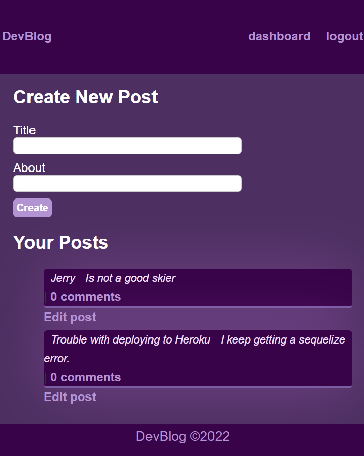

 # Dev Blog

  

## Table-of-Contents

  * [Description](#description)
  * [Installation](#installation)
  * [Usage](#usage)
  * [License](#license)
  * [Tests](#tests)
  * [Questions](#questions)
  * [Contributers](#contributers)
  

  ## [Description:](#table-of-contents)

  #### Dev Blog is a website built for programmers who want to ask questions or make posts about technology, projects, and more.

  ## [Installation](#table-of-contents)

  #### node, sql, sequelize

  ## [Usage](#table-of-contents)

  #### Create an account, login, view posts, create posts, and comment on posts.
  * [Click Here](https://tech-dev-blog.herokuapp.com/) for deployed application on Heroku

  

  
  ## License
    
  The application is covered under the following license:
    
  
  
    

  ## [Tests](#table-of-contents)

  #### Logging in and testing functionaliry of routes.

  ## [Questions](#table-of-contents)

  Please contact me using the following links:
  

  * [GitHub](http://github.com/angelagola-ko)

  * [Email: angelagola.ko@gmail.com](mailto:angelagola.ko@gmail.com)

  ## [Contributers](#table-of-contents)

  * Angela Gola &copy;2022 All Rights Reserved.

  